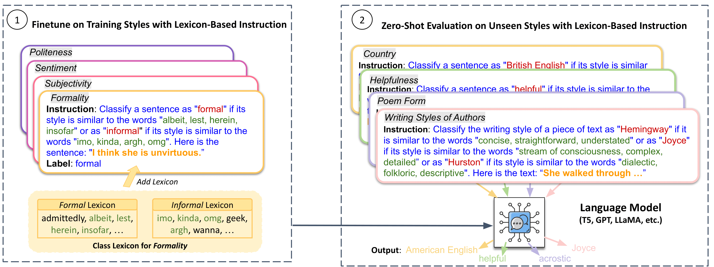

# Meta-Tuning LLMs to Leverage Lexical Knowledge for Generalizable Language Style Understanding

This repo contains the code and the benchmark for our ACL 2024 paper: <a href="https://arxiv.org/abs/2305.14592">Meta-Tuning LLMs to Leverage Lexical Knowledge for Generalizable Language Style Understanding</a>.

<p align="center">
  
</p>

## Installation
This project uses python 3.9.
```
pip install -r requirements.txt
```

## Citation
If our work inspires you, please consider citing our paper:
```
@inproceedings{guo-etal-2024-meta,
    title = "Meta-Tuning {LLM}s to Leverage Lexical Knowledge for Generalizable Language Style Understanding",
    author = "Guo, Ruohao  and
      Xu, Wei  and
      Ritter, Alan",
    editor = "Ku, Lun-Wei  and
      Martins, Andre  and
      Srikumar, Vivek",
    booktitle = "Proceedings of the 62nd Annual Meeting of the Association for Computational Linguistics (Volume 1: Long Papers)",
    month = aug,
    year = "2024",
    address = "Bangkok, Thailand",
    publisher = "Association for Computational Linguistics",
    url = "https://aclanthology.org/2024.acl-long.740",
    pages = "13708--13731",
    abstract = "Language style is often used by writers to convey their intentions, identities, and mastery of language. In this paper, we show that current large language models struggle to capture some language styles without fine-tuning. To address this challenge, we investigate whether LLMs can be meta-trained based on representative lexicons to recognize new styles they have not been fine-tuned on. Experiments on 13 established style classification tasks, as well as 63 novel tasks generated using LLMs, demonstrate that meta-training with style lexicons consistently improves zero-shot transfer across styles. We release the code and data at https://github.com/octaviaguo/Style-LLM.",
}
```
